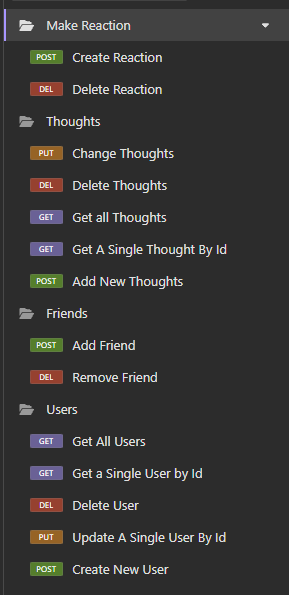
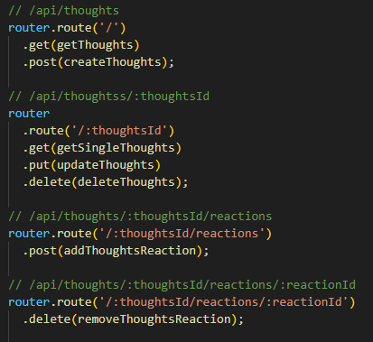
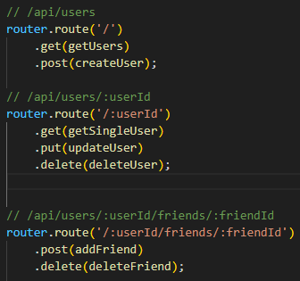

# K-Social-Network-API
  
  ## Description
  This application will let users make new users, add friends, share their thoughts, and react to other people's thoughts if they choose to do so. All of the content of this application will be accesible through insomnia. 
  ## Table of Contents
  * [Installation](#installation)
  * [Usage](#usage)
  * [Credits](#credits)
  * [License](#license)
  * [Badges](#badges)
  * [Features](#features)
  * [How to Contribute](#howToContribute)
  * [Test](#test)
  ## Installation
  Go to the this application's github repository https://github.com/kaneganteng/K-Social-Network-API.git. You will be able to clone this repository to your device.
  * Then open your terminal and do
  ```npm install``` ```npm run build``` ```npm run start```
  * After that use the proper routes for what you want to do on this application
  ## Usage
  After doing ```npm run start```, go to insomnia and use ```http://localhost:3001/api/```. Add ```users``` or ```thoughts``` to do a GET or POST. There are more routes you can use to create reactions to thoughts, update and delete users and thoughts. This will be demonstrated on the walkthrough video. Keep in mind, when trying to delete a user, thought, or reaction, you will need the id of the specified target. <br>  <br>
  * `Routes for Thoughts` <br>
   
  <br>
  * `Routes for Users` <br>
  
  ## Credits
  N/A
  ## License
  MIT 
  ## Badges
  N/A
  ## Features
  * Express.js
  * Mongoose / MongoDB
  * TypeScript
  * Insomnia
  * VSCode
  ## How to Contribute
  You can reach out to me through the Questions section where my contact information is.
  ## WalkThrough Video
  Here is the demo: COMING SOON!
  ## Questions
  Contact:
  * Name: Kane Esasta
  * Email: kaneesasta@gmail.com
  * Github: [kaneganteng](https://github.com/kaneganteng)